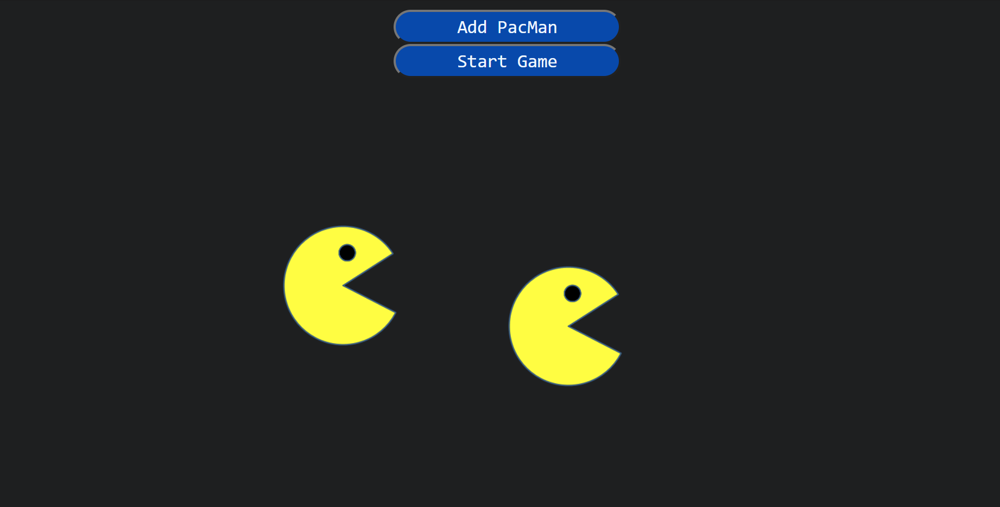

# PacMen Factory

# Description

From the **MITxPro Full Stack Development** program I present to you the PacMen generator that features the usage of JavaScript, the manipulation of the DOM and CSS styling for looks. At the click, a PacMan will be generated and placed at a random postion which will then move at a random direction when instructed to do so. Once the object reaches the edge of the screen, it will bounce off of it and move the opposite direction. Additional Pacman could be added by using the "Add Pacmen" button on the screen.

***How to run:*** Once the repository is deployed (https://dfgav1r1a.github.io/PacMen) you will find an empty screen with 2 buttons. To start, generate as many objects as you would like to see by clicking the button "Add Pacmen". To see them move randomly and bouncing off of the edges click "Start Game". No matter the resolution of your screen or the zoom, the PacMen will always find an edge and stay within the boundaries of the display. If you would like to make the objects move faster click again the "Start Game" button. To clear the screen please press the key "F5" on your keyboard or reload the page using your browser.

## Improvement Roadmap

1. Add a remove button that will delete one object from the screen.
2. Add a restart button that will reset the environment instead of using the "F5" key on the keyboard.
3. Add an option where the user can decide upon the number of objects that would be added to the screen instead of clicking the button "Add Pacmen".
4. As alternative, allow the user to manipulate the direction of the object with the arrow keys of the keyboard 
5. As alternative, allow the user to manipulate the direction of the object with the mouse movement.
6. Add a "direction" functionality where the user can decide which direction the object should go or how the object can be manipulated.

# MIT License

Copyright (c) 2020 John Williams

Permission is hereby granted, free of charge, to any person obtaining a copy
of this software and associated documentation files (the "Software"), to deal
in the Software without restriction, including without limitation the rights
to use, copy, modify, merge, publish, distribute, sublicense, and/or sell
copies of the Software, and to permit persons to whom the Software is
furnished to do so, subject to the following conditions:

The above copyright notice and this permission notice shall be included in all
copies or substantial portions of the Software.

THE SOFTWARE IS PROVIDED "AS IS", WITHOUT WARRANTY OF ANY KIND, EXPRESS OR
IMPLIED, INCLUDING BUT NOT LIMITED TO THE WARRANTIES OF MERCHANTABILITY,
FITNESS FOR A PARTICULAR PURPOSE AND NONINFRINGEMENT. IN NO EVENT SHALL THE
AUTHORS OR COPYRIGHT HOLDERS BE LIABLE FOR ANY CLAIM, DAMAGES OR OTHER
LIABILITY, WHETHER IN AN ACTION OF CONTRACT, TORT OR OTHERWISE, ARISING FROM,
OUT OF OR IN CONNECTION WITH THE SOFTWARE OR THE USE OR OTHER DEALINGS IN THE
SOFTWARE.

